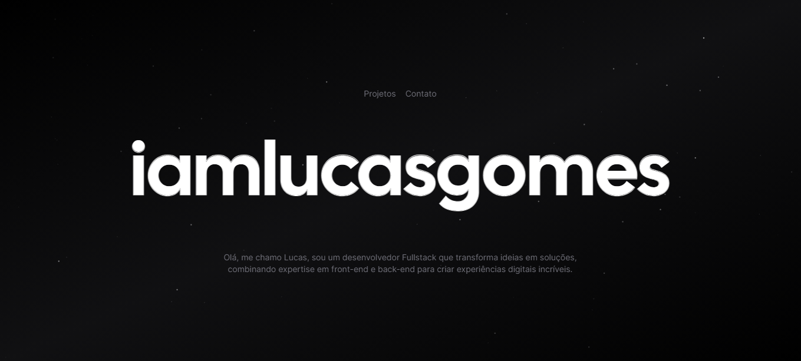

<h1 align="center">
  💻 Portfólio - Lucas Gomes
</h1>

<h4 align="center"><a href="https://www.iamlucasgomes.com/">Clique para visitar o projeto</a></h4>

## 📚 Seções

O site é composto por três seções:

- **Home:** Nele temos uma breve apresentação;
- **Projetos:** Apresenta alguns projetos desenvolvidos e com link direto para os respectivos códigos no GitHub;
- **Contato:** Temos algumas formas de entrar em contato;

---